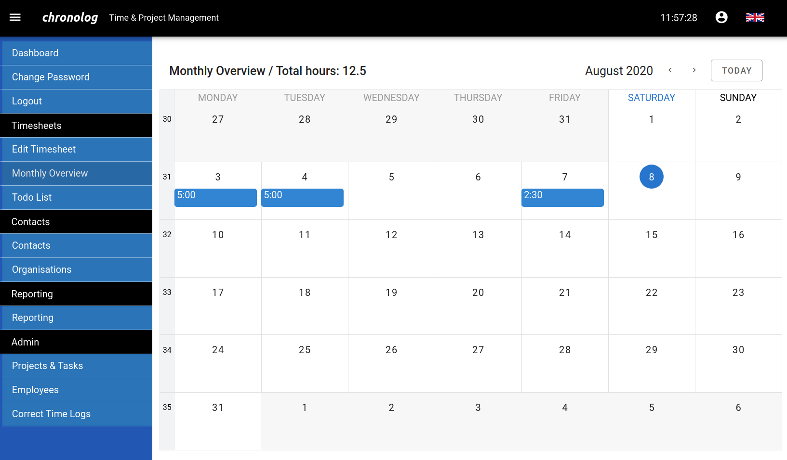

# chronolog Time Sheets

Time sheet application with TypeScript/Node.js backend and Vue/JavaScript frontend.



## Features

- Time sheet input
- Daily, weekly and monthly time sheet views
- Working time recording
- Todo lists
- Invoicing
- Printable reports
- Address administration (organisations and contacts)
- Multi-user and multi-customer

## Try out

Pull the docker image from GitHub (or Docker Hub) and follow the `Deploy` and `Run` instructions below.

```
$ docker pull ghcr.io/junglerider/chronolog/chronolog:1.1.0
  or
$ docker pull junglerider/chronolog:1.1.0
```

## Install (development)

You need the npm package manager for installation. You also need sqlite3 for building the database. The API and web application are installed separately:

```
cd api
npm install

cd ../app
npm install
```

## Build (development)

The application runs in a single Docker container. It uses an SQLite database to persist information. To create a production build, run:

```
./build docker
```

This creates a new docker image called chronolog.latest which exposes internal port 8888 (or as configured in ./api/config.json).

## Deploy

While there is an SQLite sample database included in the container image, this should only be used for demos and testing, as it will be destroyed along with the container. For a production deployment, place a chronolog.db database file into a directory of your choice and use a host mount, e.g.:

```
docker run -d --name chronolog -p 5000:8888 -v /your/db/directory:/home/db chronolog
```

This makes the application available at localhost:5000 and looks for the chronolog.db file in /your/db/directory. If you want to start with an empty database instead, copy `db/empty.db` into the mounted database directory and rename it to `chronolog.db`.

## Run

```
http://localhost:5000
```
The Chronolog web application at this URL should display a login dialogue. Sample data includes four configured users with the following user names: `enzo`, `james`, `gabriella` and `mehmed`. The `empty.db` database file only contains one user named `admin`. The passwords for all preconfigured users are left empty, so they can login without providing a password. Make sure to add a password later.